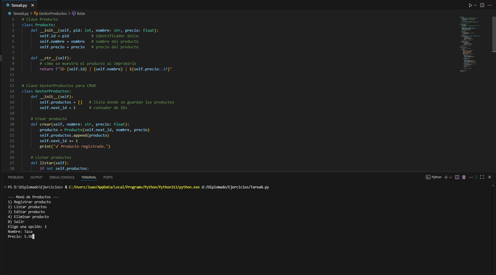
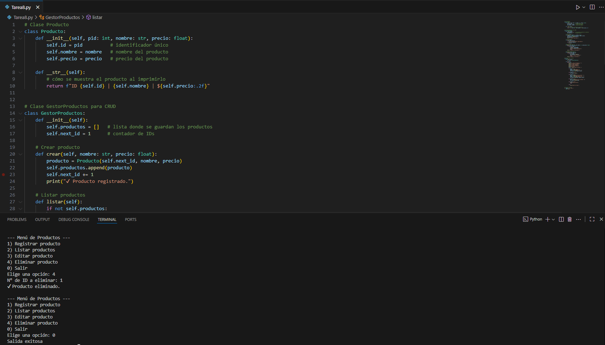

# Inventarios_Pedidos

*Este código es una solución clara y bien estructurada, ideal para aplicaciones de gestión básica. Utiliza principios de programación orientada a objetos de forma efectiva, organizando el código en clases con responsabilidades específicas que facilitan su mantenimiento y comprensión. Su impacto en el rendimiento y la memoria es excelente para el propósito previsto, ya que al operar con listas y un volumen moderado de datos, garantiza una velocidad de ejecución rápida y un consumo de recursos mínimo, siendo sumamente eficiente.*

# **ELIMINAR PRODUCTO**

# **EDITAR PRODUCTO**

# **LISTAR PRODUCTO**

# **MENU PRINCIPAL**

# **REGISTRO DE PRODUCTO**

# **SALIR DEL PROGRAMA**

